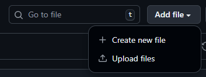
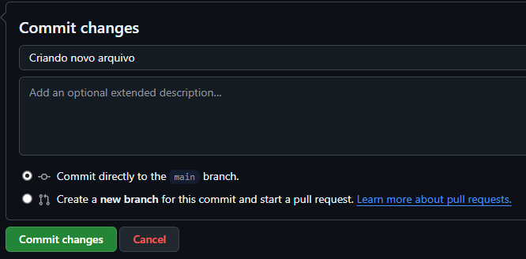

# GitHub
> Tutorial de GitHub da disciplina Projeto de Sistemas de Software

## Introdução
O GitHub é uma plataforma online que funciona como uma "rede social" de programação. Nela, é possível armazenar, compartilhar e trabalhar com outras pessoas no desenvolvimento de códigos.

Uma das grandes vantagens do GitHub é que, por estar na nuvem, todos os códigos que você armazenar estarão disponíveis na sua conta independente do computador que você use para acessar. Já do ponto de vista colaborativo, a plataforma permite que várias pessoas trabalhem ao mesmo tempo em um mesmo projeto sem que o código fique bagunçado.

### Git: a base do GitHub
O trabalho colaborativo do GitHub só é possível graças ao Git, um sistema de controle de versão que acompanha as alterações que são feitas nos arquivos. Desse modo, por mais que muitas pessoas estejam trabalhando no mesmo arquivo, o Git consegue rastrear cada uma das alterações, além de permitir que cópias e integrações sejam feitas nesses códigos sem que o seu trabalho afete o dos outros.

## Criando uma conta
Assim como em uma rede social, antes de publicar algo, é necessário ter uma conta. Então, a primeira etapa é criar a sua conta no GitHub.

> [!IMPORTANT]
> No GitHub você consegue acessar qualquer repositório que esteja público mesmo **sem ter uma conta**. A criação de contas só é necessária caso você também queira armazenar ou publicar seus códigos.

A criação da conta é muito simples:
1. Acesse github.com;
2. Vá em "Criar uma conta";
   * Você pode criar uma nova conta usando email ou usando sua conta do Google.
3. Finalize os passos que vão aparecer na sua tela;
4. Fim. Conta criada!

> Saiba mais aqui: [Sobre o Git](https://docs.github.com/pt/get-started/start-your-journey/about-github-and-git#about-git)

## O primeiro repositório
Cada projeto que você salva no GitHub é chamado de **repositório**, uma estrutura muito semelhante à uma pasta do seu computador. Um repositório geralmente agrupa itens que pertencem ao mesmo "projeto" ou coisa em que você está trabalhando.

### Configurações iniciais
Vamos à criação do seu primeiro repositório:
1. **Acesse a aba "Repositories"**  
   
   

2. **Clique no botão "New"**  
   
   

3. **Insira o nome e descrição do repositório**  
   O nome do repositório deve ser curto e objetivo. Além disso, esse nome não pode contar com espaços em branco, acentos ou caracteres especiais.
   Já a descrição pode ser mais longa (até 350 caracteres), servindo para apresentar resumidamente o seu repositório. Na descrição você pode escrever normalmente, sem se preocupar com acentos e espaços.

   

4. **Escolha se o repositório será público ou privado**  
   Caso você queira que os materiais inseridos no repositório sejam públicos, ou seja, qualquer pessoa na internet possa acessar, você deve optar por um repositório **público**.  
   No caso materiais ou códigos que você deseje guardar apenas para você, selecione a opção de repositório privado.

   

5. **Adicione um arquivo README no seu repositório**  
   O arquivo README (LEIA-ME, em português) serve comunicar informações importantes do seu repositório. Pensando em um repositório que armazena um projeto, geralmente é interessante acrescentar:
   * O que o projeto faz
   * Por que o projeto é útil
   * Como os usuários podem começar a usar o projeto
   * Onde os usuários podem obter ajuda com seu projeto
   * Quem mantém e contribui com o projeto
  
   

6. **Crie o respositório**  
   
   

### Inserindo novos arquivos
Como já foi mencionado, os repositórios funcionam de um modo parecido com pastas no computador. Então, dentre outras funcionalidades, podemos armazenar arquivos nesses repositórios.

Existem duas principais formas de inserir um novo arquivo em seu repositório: pelo site ou via linha de comando. Neste tutorial, focaremos na inserção de arquivos pelo site.

Para adicionar arquivos que já estão no seu computador (como um documento Word, um PDF ou um arquivo de código):  

1. **Clique no botão "Add file"**  
   No canto superior direito da lista de arquivos do seu repositório, clique no menu suspenso.  

   

2. **Selecione "Upload files"**  
   Você será redirecionado para uma área onde pode arrastar seus arquivos ou selecioná-los no explorador de arquivos.  

3. **Realize o "Commit" (Salvar as alterações)**  
   Esta é a parte mais importante. No GitHub, não basta apenas jogar o arquivo lá; você precisa confirmar a gravação dessa alteração. Esse processo é chamado de **Commit**.  
   * Role a página até ver a caixa "Commit changes"    
   * Escreva uma mensagem curta descrevendo o que você está enviando (ex: "Adicionando slide da aula 01")  
   * Clique no botão verde **Commit changes**  

   

### Criando pastas
Diferente do computador, no GitHub, não existe um botão "Nova Pasta" simples. O GitHub só cria uma pasta se houver um arquivo dentro dela.   

Para criar uma estrutura de pastas para organizar suas disciplinas, o truque é criar um novo arquivo e digitar o **caminho** da pasta:

1. Vá novamente em **Add file**, mas agora escolha **Create new file**    
2. No campo onde você digita o nome do arquivo, digite o **nome da pasta** que você quer criar seguido de uma barra `/`  
   * Exemplo: Ao digitar `Disciplina/`, o GitHub transformará esse texto automaticamente em uma pasta  

     

3. Logo após a barra, dê um nome para o arquivo que ficará dentro dessa pasta (geralmente criamos um arquivo chamado `.gitkeep` apenas para "segurar" a pasta)   
4. Role a página até o final e faça o **Commit** (como fizemos no passo anterior) para salvar a nova pasta e o arquivo  


## Atividade Prática: O Repositório "Mais TI"
Agora vamos aplicar os princípios de organização de projetos. Sua tarefa é estruturar o repositório central que acompanhará você durante todo o curso.

Como estamos em uma disciplina de Projeto de Sistemas, a **padronização** é fundamental. Por isso, seguiremos regras estritas de nomenclatura para evitar problemas técnicos no futuro (boas práticas de Engenharia de Software).

#### O desafio

1. **Crie o Repositório**  
   * Nome: `mais-ti` (tudo minúsculo)  
   * Visibilidade: Público  
   * **Importante:** Marque a opção "Add a README file" na criação  

2. **Crie a Estrutura de Pastas**
   Utilizando o método de criar arquivos para gerar pastas, crie a seguinte estrutura.  
   *Atenção à regra:* Não use acentos nem espaços. Use hífens para separar palavras e números para ordenar as pastas:  

   * `01-Programacao-Computadores/`  
   * `02-Projeto-Sistemas-Software/`  
   * `03-Desenvolvimento-Web/`  
   * `04-Programacao-Mobile/`  

   *Dica: Dentro de cada pasta, crie um arquivo chamado `LEIAME.md` (ou `README.md`) com uma breve descrição da matéria para que a pasta seja salva.*

3. **Gerenciamento de Mudanças (Commits)**
   Não escreva qualquer coisa na hora de salvar. Um bom gerente de projetos mantém o histórico limpo.  
   * Para cada pasta que criar, use uma mensagem de commit padronizada, ex: `Adiciona estrutura da disciplina de Web`.

Ao final, seu repositório `mais-ti` deve listar as 4 pastas organizadas e acessíveis na página inicial.

A sua estrutura deve ficar dessa forma:

```
mais-ti/
│
├── README.md
│
├── 01-Programacao-Computadores/
│   └── README.md
│
├── 02-Projeto-Sistemas-Software/
│   └── README.md
│
├── 03-Desenvolvimento-Web/
│   └── README.md
│
└── 04-Programacao-Mobile/
    └── README.md
```