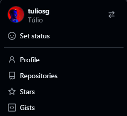
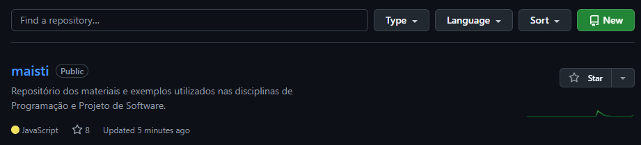
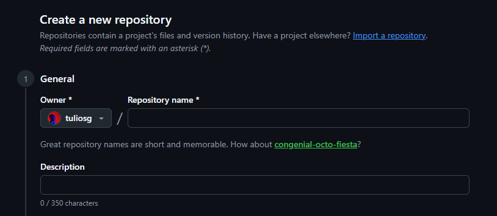
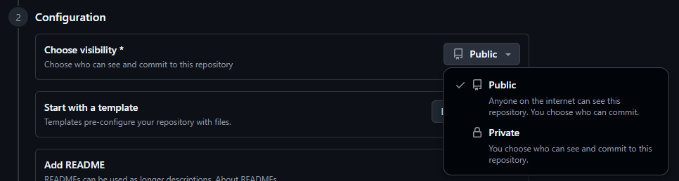
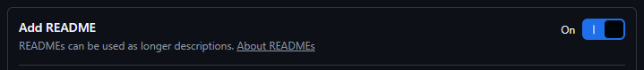

# GitHub
> Tutorial de GitHub da disciplina Projeto de Sistemas de Software

## Introdução
O GitHub é uma plataforma online que funciona como uma "rede social" de programação. Nela, é possível armazenar, compartilhar e trabalhar com outras pessoas no desenvolvimento de códigos.

Uma das grandes vantagens do GitHub é que, por estar na nuvem, todos os códigos que você armazenar estarão disponíveis na sua conta independente do computador que você use para acessar. Já do ponto de vista colaborativo, a plataforma permite que várias pessoas trabalhem ao mesmo tempo em um mesmo projeto sem que o código fique bagunçado.

### Git: a base do GitHub
O trabalho colaborativo do GitHub só é possível graças ao Git, um sistema de controle de versão que acompanha as alterações que são feitas nos arquivos. Desse modo, por mais que muitas pessoas estejam trabalhando no mesmo arquivo, o Git consegue rastrear cada uma das alterações, além de permitir que cópias e integrações sejam feitas nesses códigos sem que o seu trabalho afete o dos outros.

## Criando uma conta
Assim como em uma rede social, antes de publicar algo, é necessário ter uma conta. Então, a primeira etapa é criar a sua conta no GitHub.

> [!IMPORTANT]
> No GitHub você consegue acessar qualquer repositório que esteja público mesmo **sem ter uma conta**. A criação de contas só é necessária caso você também queira armazenar ou publicar seus códigos.

A criação da conta é muito simples:
1. Acesse github.com;
2. Vá em "Criar uma conta";
   * Você pode criar uma nova conta usando email ou usando sua conta do Google.
3. Finalize os passos que vão aparecer na sua tela;
4. Fim. Conta criada!

> Saiba mais aqui: [Sobre o Git](https://docs.github.com/pt/get-started/start-your-journey/about-github-and-git#about-git)

## O primeiro repositório
Cada projeto que você salva no GitHub é chamado de **repositório**, uma estrutura muito semelhante à uma pasta do seu computador. Um repositório geralmente agrupa itens que pertencem ao mesmo "projeto" ou coisa em que você está trabalhando.

### Configurações iniciais
Vamos à criação do seu primeiro repositório:
1. **Acesse a aba "Repositories"**
   

2. **Clique no botão "New"**
   

3. **Insira o nome e descrição do repositório**
   O nome do repositório deve ser curto e objetivo. Além disso, esse nome não pode contar com espaços em branco, acentos ou caracteres especiais.
   Já a descrição pode ser mais longa (até 350 caracteres), servindo para apresentar resumidamente o seu repositório. Na descrição você pode escrever normalmente, sem se preocupar com acentos e espaços.

   

4. **Escolha se o repositório será público ou privado**
   Caso você queira que os materiais inseridos no repositório sejam públicos, ou seja, qualquer pessoa na internet possa acessar, você deve optar por um repositório **público**. No caso materiais ou códigos que você deseje guardar apenas para você, selecione a opção de repositório privado.

   

5. **Adicione um arquivo README no seu repositório**
   O arquivo README (LEIA-ME, em português) serve comunicar informações importantes do seu repositório. Pensando em um repositório que armazena um projeto, geralmente é interessante acrescentar:
   * O que o projeto faz
   * Por que o projeto é útil
   * Como os usuários podem começar a usar o projeto
   * Onde os usuários podem obter ajuda com seu projeto
   * Quem mantém e contribui com o projeto
  
   

6. **Crie o respositório**
   

### Inserindo novos arquivos

### Criando pastas

